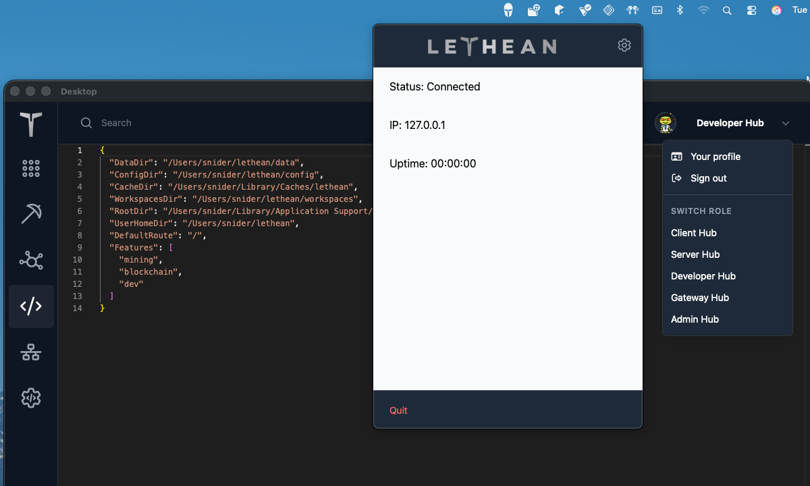
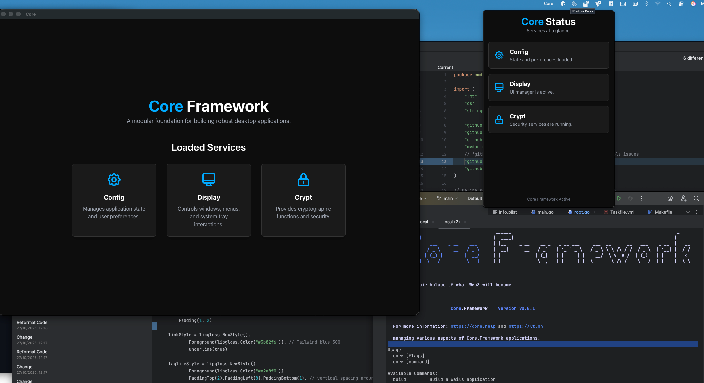
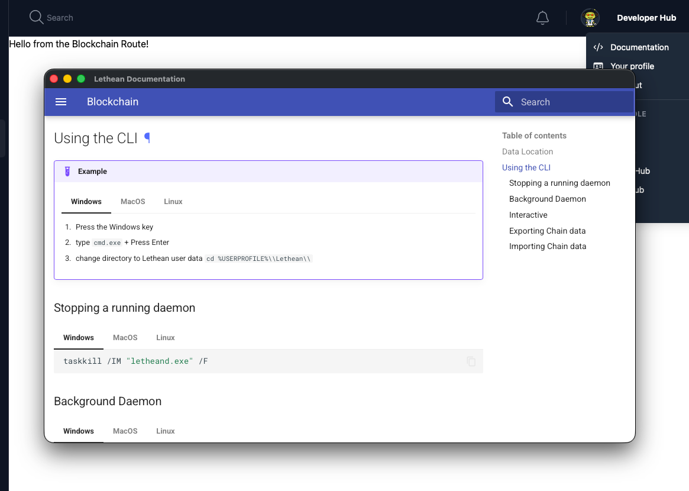
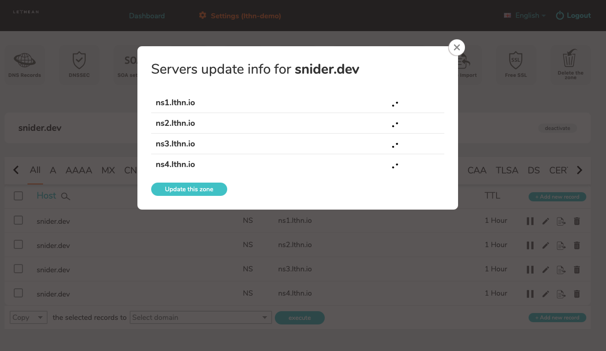
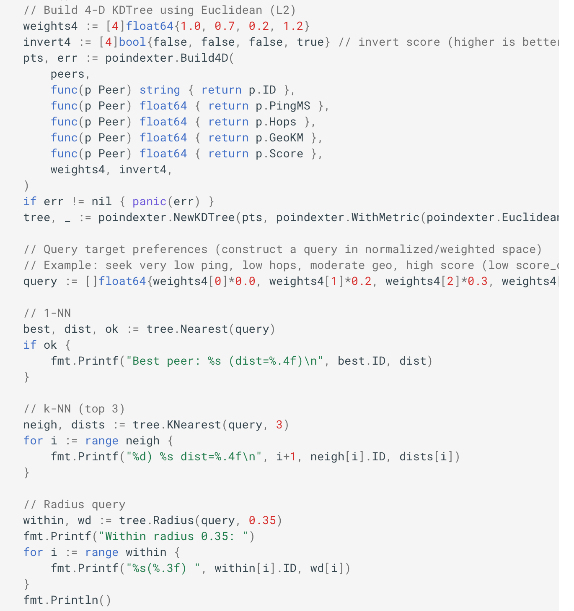
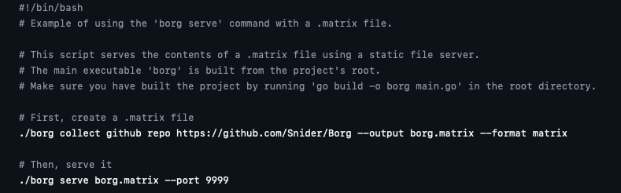
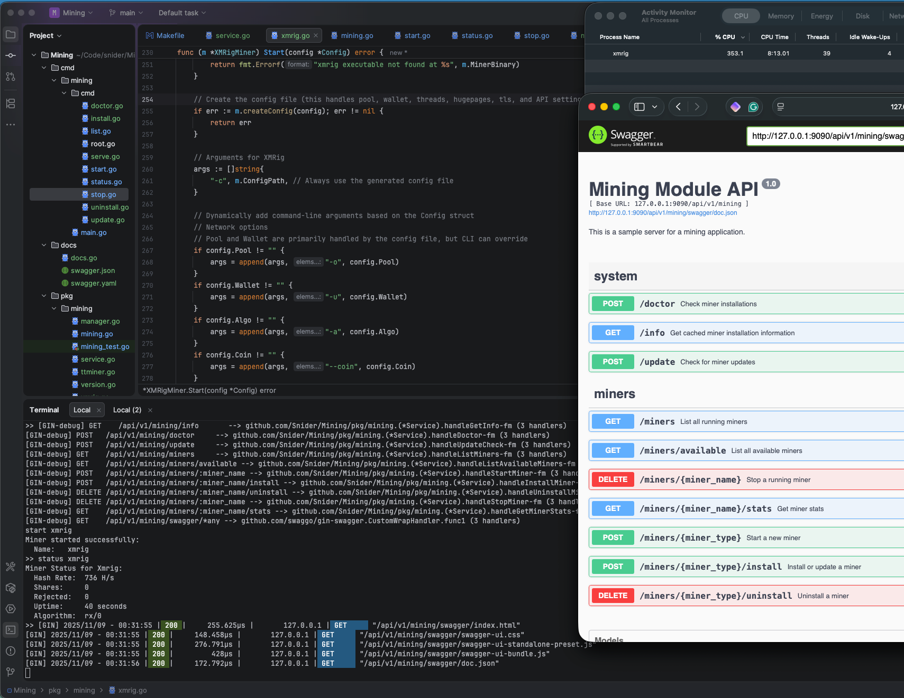
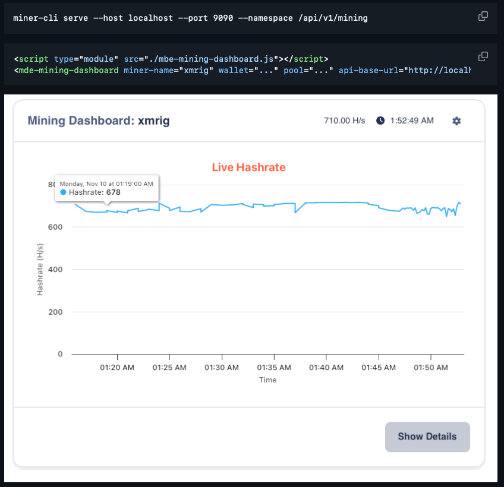

# November Development Update

Since the last post, we have a DNS service that is now fully functional and the start of an end user / last-mile Web3 framework. This update expands the projects spun out of Lethean Desktop into reusable components, their current status, technical notes, links, and next steps.
<!-- more -->

## Highlights

- `dns.lthn.io` deployed and resolving internal test zones.
- Core framework modules extracted from Lethean Desktop and published internally.
- Demo tooling (Poindexter, RootFS datanode, Miner-CLI) documented for contributors.
- Early adopter workflows for packaging and local dev validated on macOS.

New projects that take the core functionality out of our Lethean Desktop into a reusable framework.

## Lethean Desktop

Status: Stable — active maintenance and demo reference.

Technical notes:

- Purpose: Reference native-like desktop app integrating framework modules.
- Frontend: HTML/CSS/TypeScript.

## Core.Framework

Status: Beta — expanding API coverage and examples.

Provides a framework for building client-side native Web3 applications with web technologies.

Key features:

- Modular plugin loader for app extensions.
- Secure local storage and key handling (encrypted stores).
- Cross-platform event/IPC primitives and lifecycle management.

## Core.Help

Status: Alpha — usable and embeddable.

Provides client-side deep-linkable help documentation that opens in its own window.

## dns.lthn.io

Status: Live — monitoring enabled.

Details:

- Purpose: name resolution for demo/test networks and discovery for local/dtest deployments.
- Focus: privacy, low-latency lookups, .lthn TLD resolution on web2.
- Observability: logs, basic metrics, and alerting configured.

## Poindexter

Repository: https://github.com/Snider/Poindexter

Status: Production-ready for benchmarking and peer selection.

Summary:

- Purpose: find the best peer(s) in very large peer lists (100k+).
- Approach: compact 4-dimensional data structure enabling millisecond scoring.
- Use cases: bootstrapping, peer selection, health checks, and prioritizing connections.

Highlights:

- Extremely fast peer scoring and ranking.
- Integration example included in Core.Framework demos.
- Benchmarks and profiling included in repo README.

## RootFS datanode

Status: Proof-of-concept — usable for isolated snapshots.

Summary:

- Purpose: take snapshots of remote files and serve them in an isolated environment for reproducible external apps.
- Storage: compressed snapshot bundles with metadata and manifest.
- Serving: local HTTP endpoints, optional mount support for development.

Technical notes:

- Snapshot format optimized for quick restores and small disk overhead.
- CLI for snapshot creation, verification, and serving.
- Intended for demo content, reproducible builds, and sandboxed content serving.

## Miner-CLI

Status: Demo — developer tooling and onboarding example.

Summary:

- Demonstrates adding custom applications to Lethean Desktop using pure HTML, CSS, and JavaScript.
- Includes a CLI scaffolder, example UI packaged as an extension, and docs for Core.Framework integration.

## What changed since last update

- DNS service deployed and integrated with demo apps.
- Core modules extracted and published internally for reuse.
- Poindexter optimizations merged and benchmarked.
- RootFS snapshot flow improved with faster restore paths.
- Miner-CLI scaffolding added to onboarding docs.

That's all you get for now. Until next time.

Take Care

Snider  
Lethean Developer  
_I Would Love To Change The World, But They Won't Give Me The Source Code_
